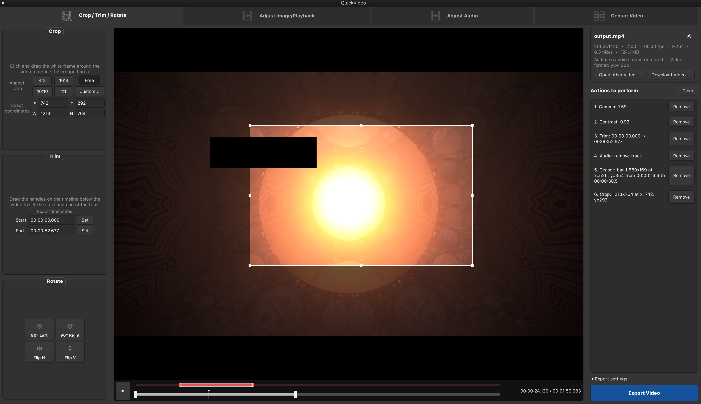

# Viditron

Viditron brings FFmpeg and yt-dlp together in a lightweight GTK4 app for quick video jobs. Without leaving the app, you can download a video from YouTube or Instagram, crop and trim it, adjust the picture or audio, and even censor parts you don't want to show with black bars, then convert and export it ready to share.



## Features

### Crop, Trim & Rotate

- Interactive crop rectangle directly over the video preview
- Drag handles for moving and resizing the crop
- Preset, free and custom aspect ratios
- Exact X, Y, width and height controls
- Interactive trim handles on the timeline
- Exact trim start/end times
- Rotate left or right
- Flip horizontally or vertically

### Image & Playback

Adjust:

- Brightness
- Contrast
- Saturation
- Gamma
- Temperature
- Sharpness
- Playback speed

Image adjustments can be previewed before exporting.

### Audio

Adjust:

- Volume
- Mute
- Normalize
- Remove audio
- Audio pitch
- Voice clarity
- Rumble reduction

### Censor Video

- Draw black censor bars directly on the video preview
- Move and resize censor regions
- Set individual start and end times
- Use multiple censor regions at once
- Color-coded regions and timeline ranges
- Censor bars are rendered into the exported video with FFmpeg

### Video Downloads

With `yt-dlp` installed, Viditron can download videos from YouTube, Instagram and other sites supported by `yt-dlp`, then open them directly for editing.

Downloaded videos are saved to:

```text
~/Downloads/Viditron/
```

### Export

Viditron builds the appropriate FFmpeg filter chain from your edits and exports the result without modifying the original file.

Export options include different quality/compression levels, lossless output and target file size.

## Install

The easiest way to install Viditron on Ubuntu or Debian is to download the latest `.deb` from the [GitHub Releases page](https://github.com/visageeee/viditron/releases/latest).

Then install the downloaded package with:

```bash
sudo apt install ./viditron_*.deb
```

Viditron can then be launched from the application menu or from a terminal:

```bash
viditron
```

## Ubuntu / Debian dependencies

The Debian package installs the required dependencies automatically. To install them manually when running from source:

```bash
sudo apt install python3-gi gir1.2-gtk-4.0 ffmpeg \
  gstreamer1.0-plugins-base gstreamer1.0-plugins-good \
  gstreamer1.0-plugins-bad gstreamer1.0-libav
```

For video downloading, optionally install:

```bash
sudo apt install yt-dlp
```

## Run from source

Clone the repository and enter the project directory:

```bash
git clone https://github.com/visageeee/viditron.git
cd viditron
python3 run.py
```

Or open a video directly:

```bash
python3 run.py /path/to/video.mp4
```

## Build Debian package

Build a package with:

```bash
./packaging/build-deb.sh 0.1.0
```

The resulting package is written to:

```text
dist/viditron_0.1.0_all.deb
```

Install it with:

```bash
sudo apt install ./dist/viditron_0.1.0_all.deb
```

`yt-dlp` is a recommended rather than required dependency.

## Status

Viditron is under active development. It is intended as a quick editing utility rather than a replacement for a full non-linear video editor.
